<p align="center">
    
</p>
<h3 align="center">Self‑hosted uptime monitoring tool for teams and individuals</h3>

> [!WARNING]
> ⚠️ The project is in **alpha** and under **very active** development.  
> ⚠️ Expect bugs and breaking changes.  
> ⚠️ **Do not rely on this as your sole monitoring solution.**

## 🚀 Features

- Uptime monitoring for HTTP(s) / HTTP(s) Keyword / Ping / DNS Record / Push / SSL Certificates
- Multi-user / Team management
- Email, Discord, Slack & Apprise notifications
- Fast setup & SEO‑friendly
- 30-second monitoring intervals
- [Multi-language support](https://github.com/poweruptime/poweruptime/tree/main/web/src/assets/i18n)
- Multiple status pages with custom domains
- In-depth monitor analytics
- 2FA & OAuth2 authentication

| 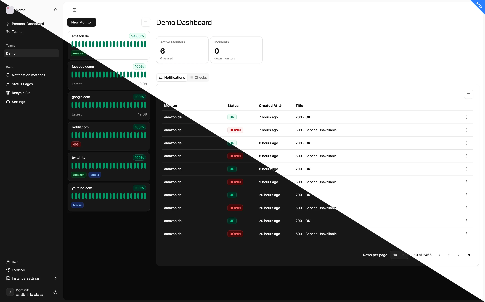 | 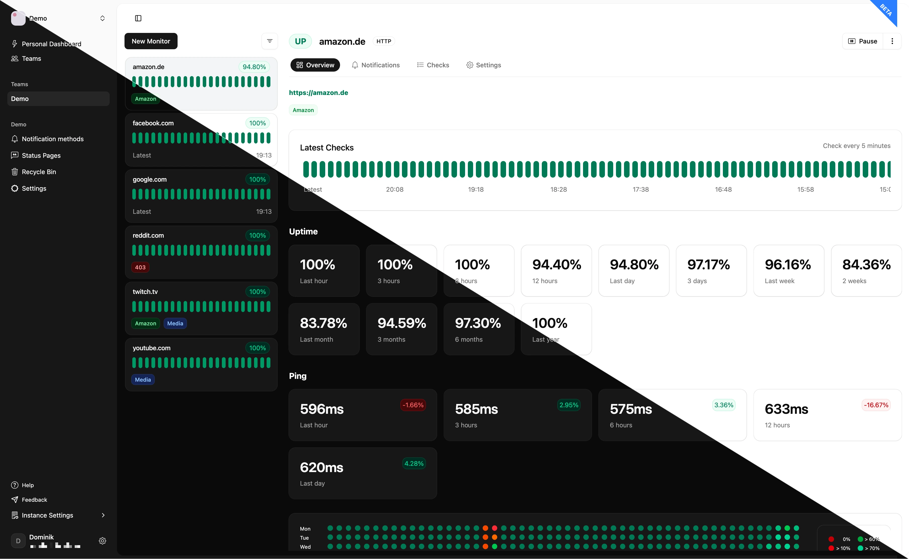 | 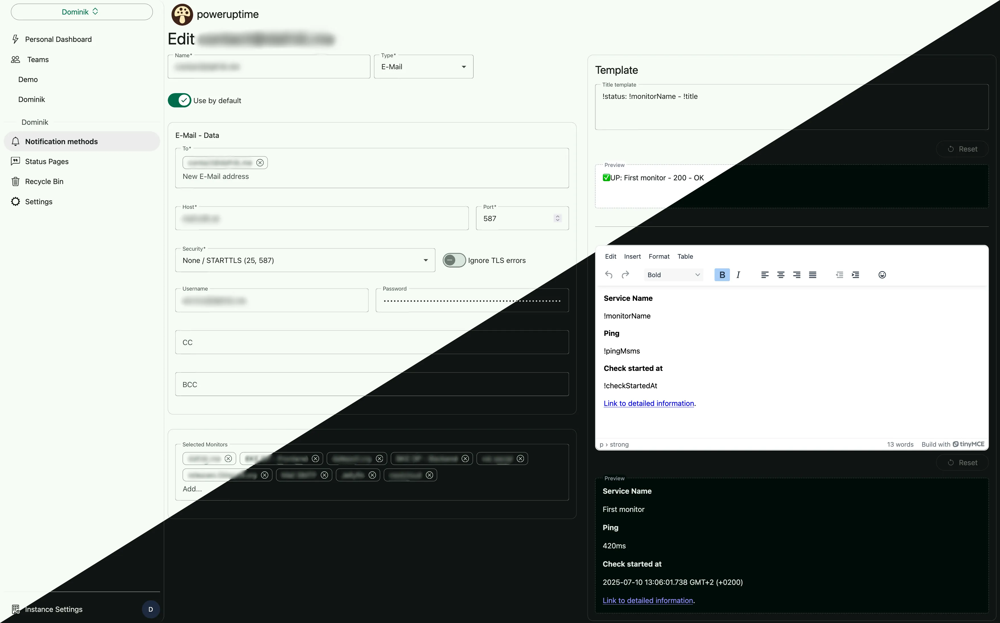 |
| :----------------------------------------------------------: | :------------------------------------------------------: | :------------------------------------------------------------------------------: |

## Installation

poweruptime can be self‑hosted with Docker Compose.

Checkout our [docker compose instructions](./infrastructure/README.md).

1. Clone the [docker-compose repository](https://github.com/poweruptime/docker-compose):
   ```shell
   git clone https://github.com/poweruptime/docker-compose.git poweruptime && cd ./poweruptime && chmod +x ./pu
   ```
2. Run setup:
   ```shell
   ./pu setup
   ```
3. Ensure no other services are running on ports `80` or `443`.
4. Start the stack:
   ```shell
   ./pu start
   ```

## How to update

Follow the update instructions [here](./infrastructure/README.md).

## Screenshots

|        |    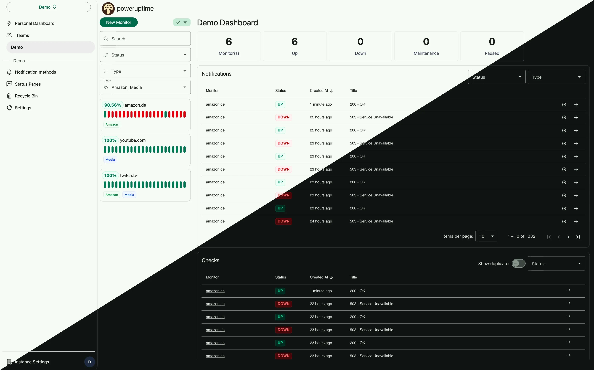    |            |
| :----------------------------------------------------------------: | :------------------------------------------------------------------------------: | :----------------------------------------------------------------: |
|    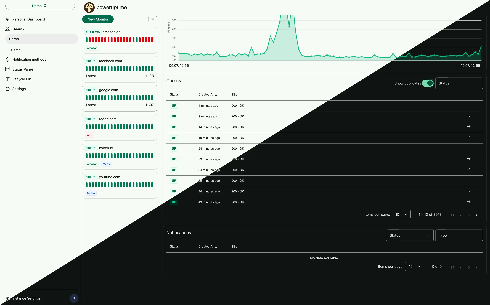     |             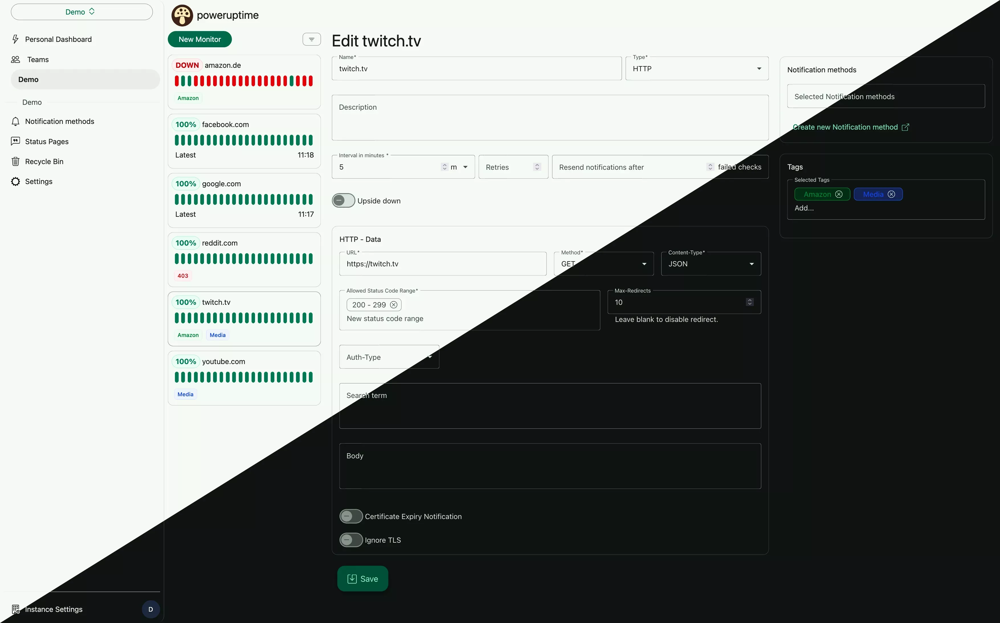             | 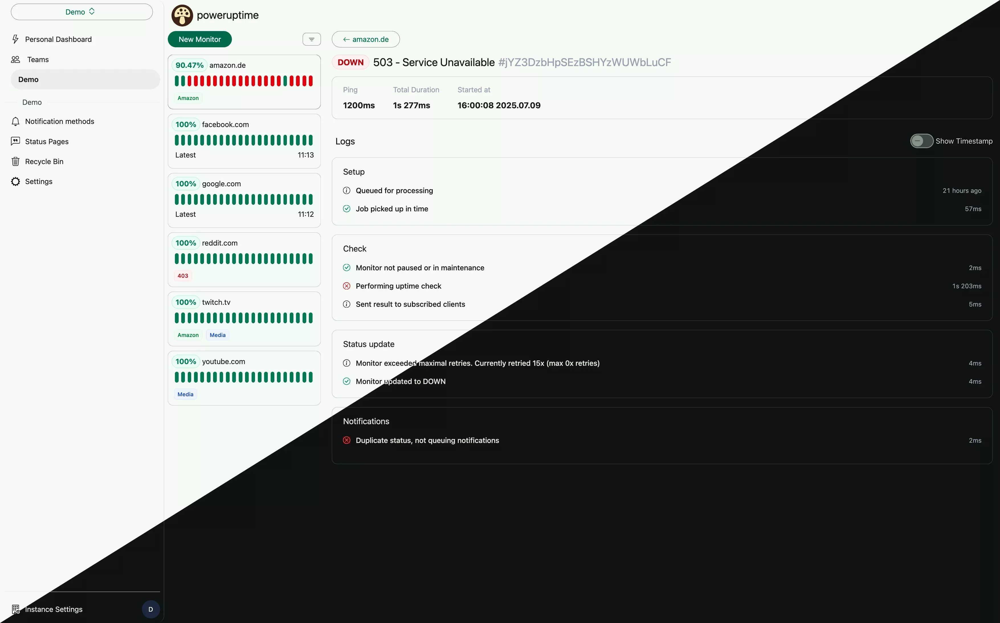 |
| 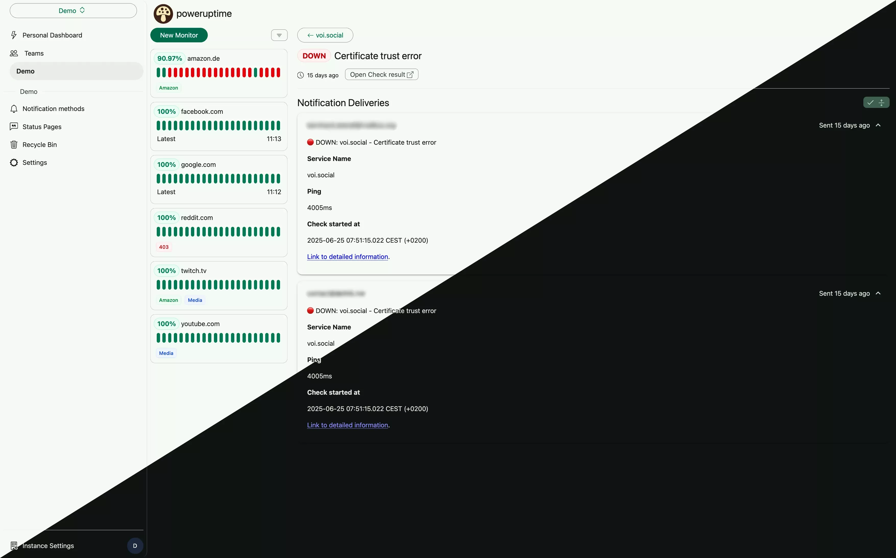 |  |  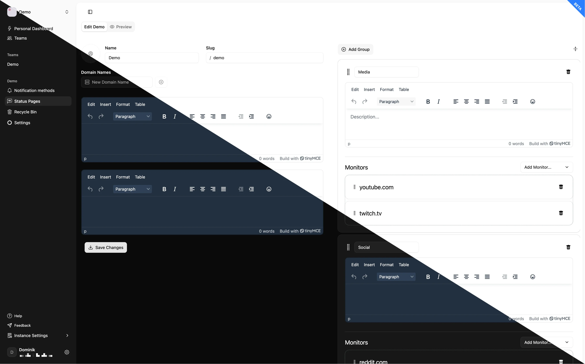  |
|       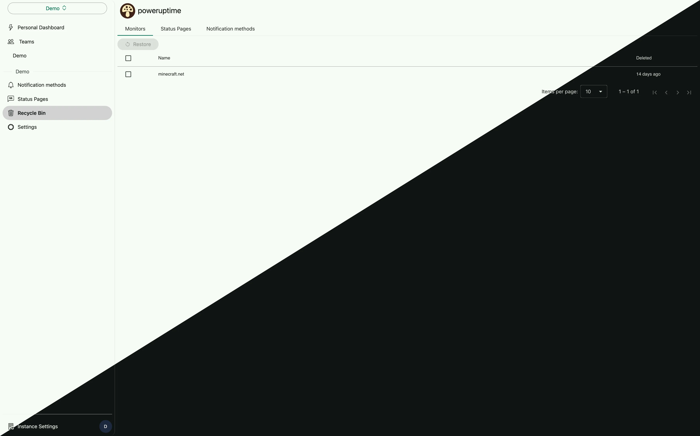       |            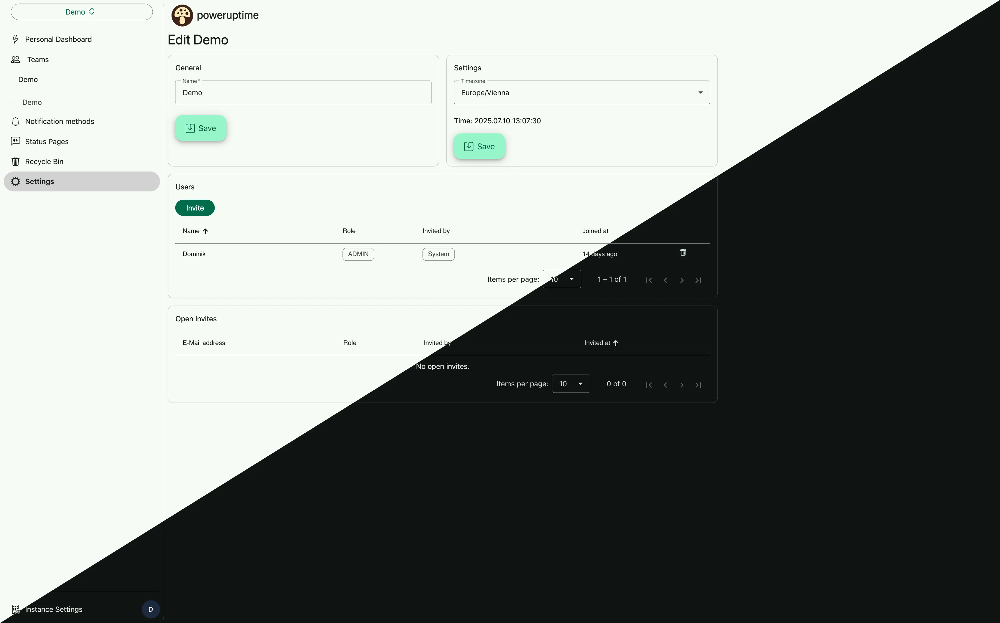            |  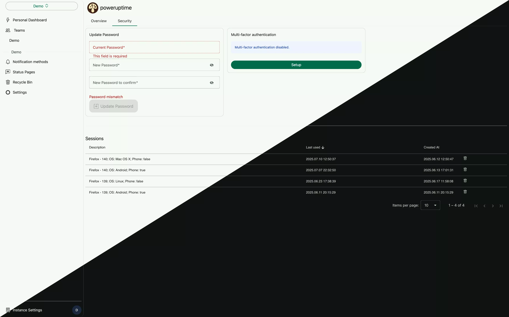  |
| 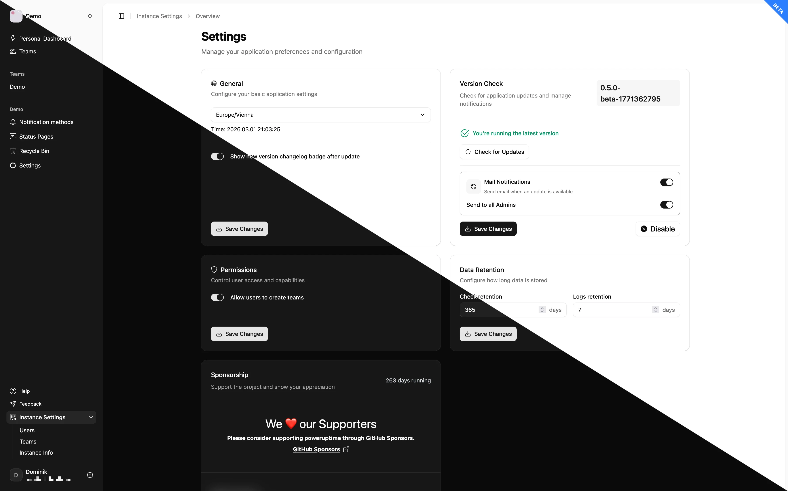 |                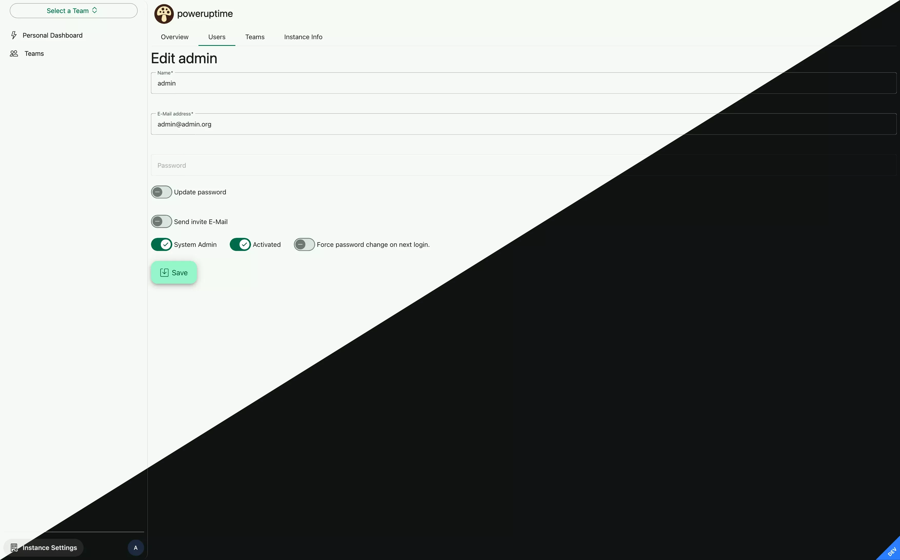                |    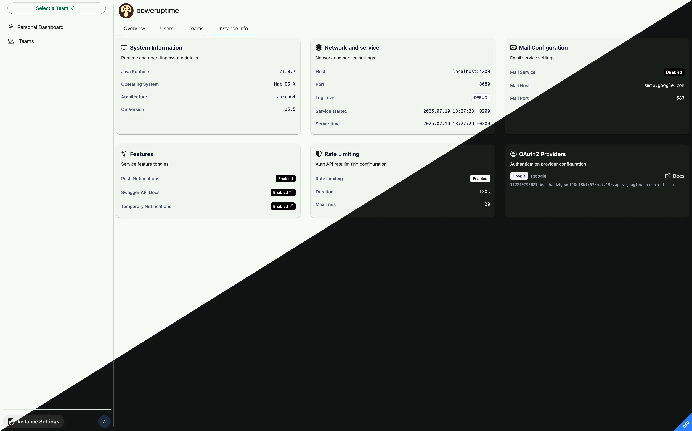    |

## Contributing to the project

We welcome all contributions!

Please check [DEVELOPER.md](/.github/DEVELOPER.md) for documentation on running the project locally and [CONTRIBUTING.md](/.github/CONTRIBUTING.md) for contribution guidelines.

## Motivation

- Long-time usage of [uptime-kuma](https://github.com/louislam/uptime-kuma) but wanted a more scalable, modern architecture.
- Desire to share uptime monitoring with friends or teams — each managing their own services.
- Interest in exploring Server-Sent Events ([SSE](https://developer.mozilla.org/en-US/docs/Web/API/Server-sent_events/Using_server-sent_events)) instead of WebSockets for simplicity and performance.
- Building a full‑stack monorepo combining Angular and Kotlin Spring Boot.
